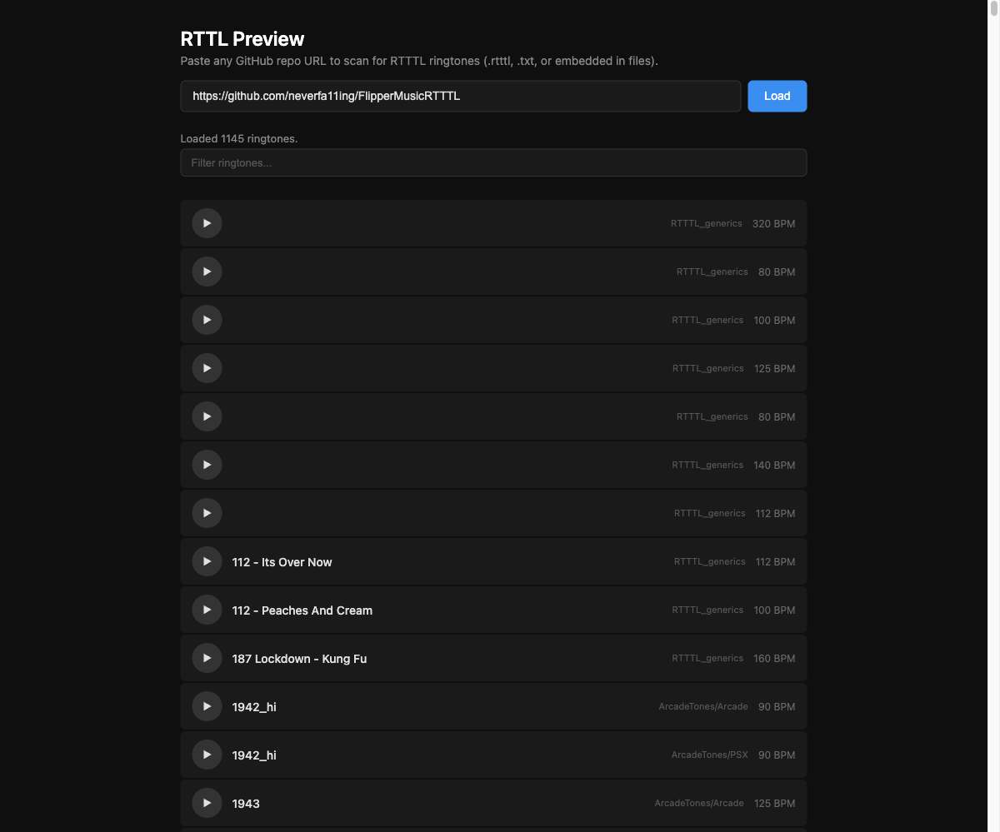
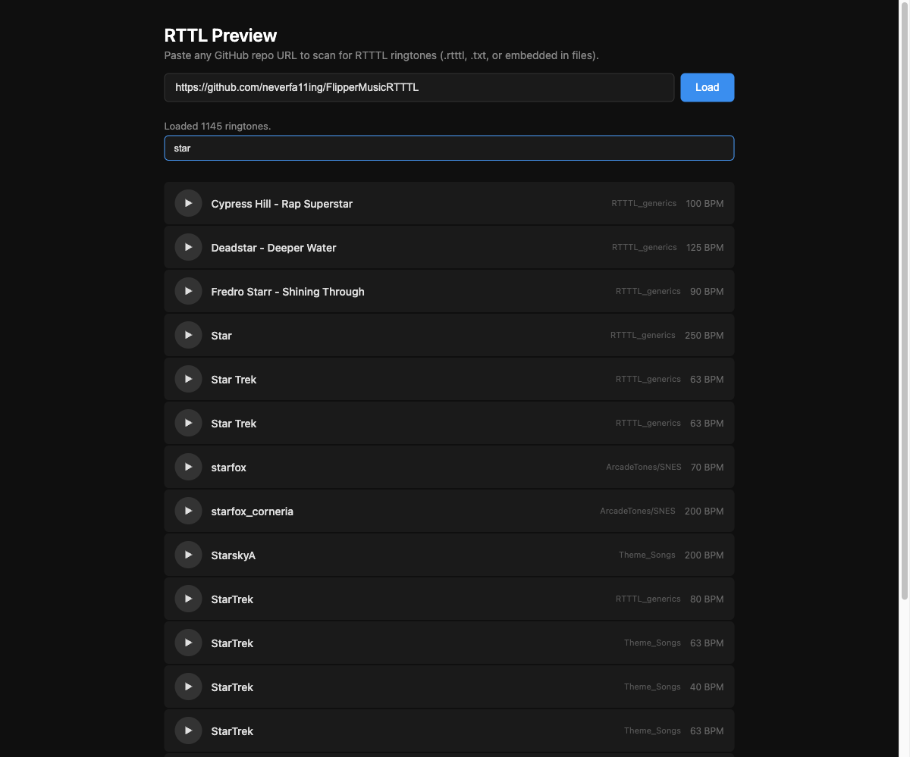

# RTTL Preview

A simple, self-hosted web app for browsing and previewing RTTTL ringtones from any GitHub repository. Paste a repo URL, and it scans the entire repo for RTTTL data — no copy/pasting or downloading required.



## How It Works

1. Paste any GitHub repository URL into the input bar
2. Click **Load** — the app uses the GitHub API to recursively scan the repo for `.rtttl`, `.txt`, and `.rttl` files
3. Each file is fetched and checked for valid RTTTL content (supports files with multiple ringtones per file)
4. Hit the play button next to any ringtone to hear it instantly

Ringtones are played using the Web Audio API with a square wave oscillator, giving them that classic Nokia sound.

### Filtering

Use the filter bar to quickly search by ringtone name or folder path.



## Features

- **Any GitHub URL format** — `github.com/owner/repo`, `/tree/branch/path`, specific commits, etc.
- **Recursive repo scanning** — finds RTTTL files in any subdirectory
- **Smart detection** — validates file contents, not just extensions
- **Instant playback** — click to play, click again to stop
- **Zero dependencies** — single HTML file, no build step, no external libraries

## Usage

Just open `index.html` in a browser. That's it.

```
git clone https://github.com/bilsonwilcox/rttl-preview.git
open rttl-preview/index.html
```

Or host it anywhere that serves static files.

## Note

This app uses the GitHub API (unauthenticated), which has a rate limit of 60 requests per hour. Large repos with many files may use several requests during the content-fetching phase.
